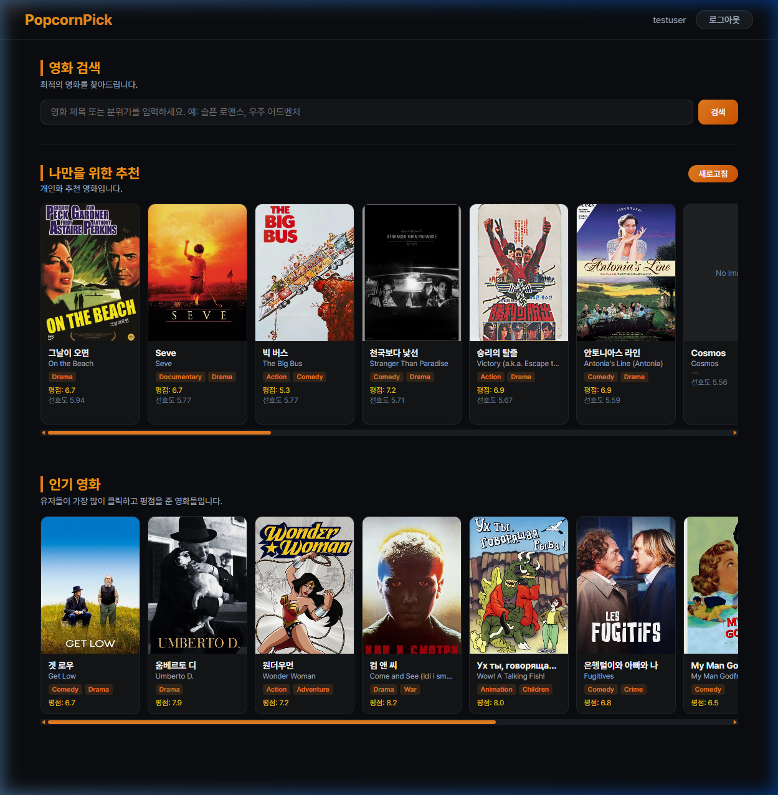
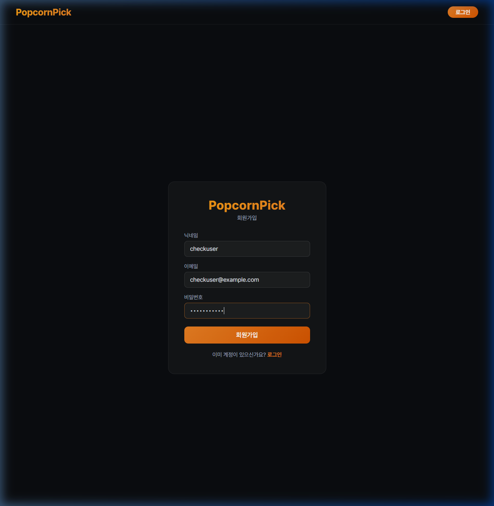
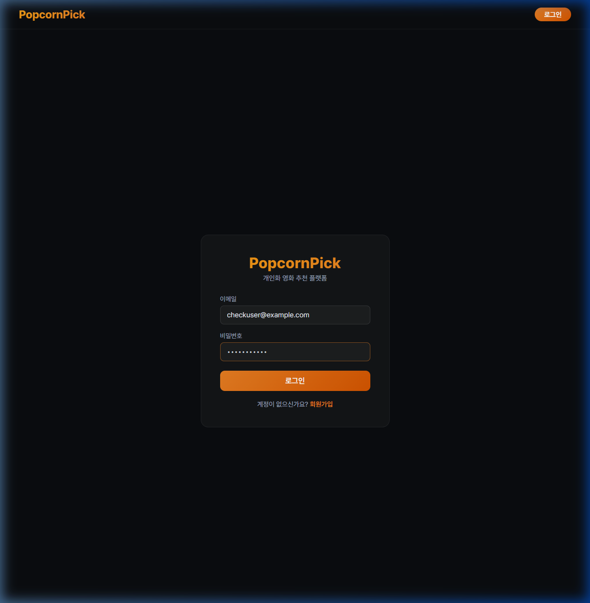
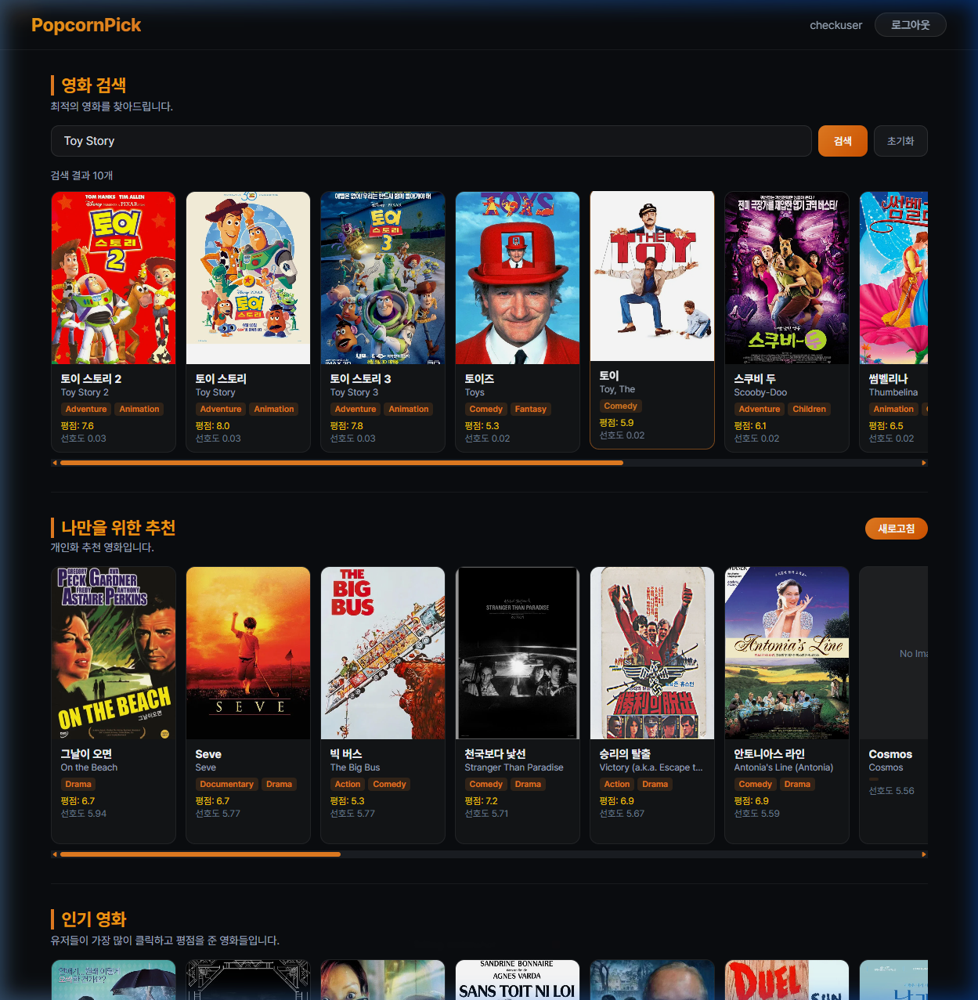
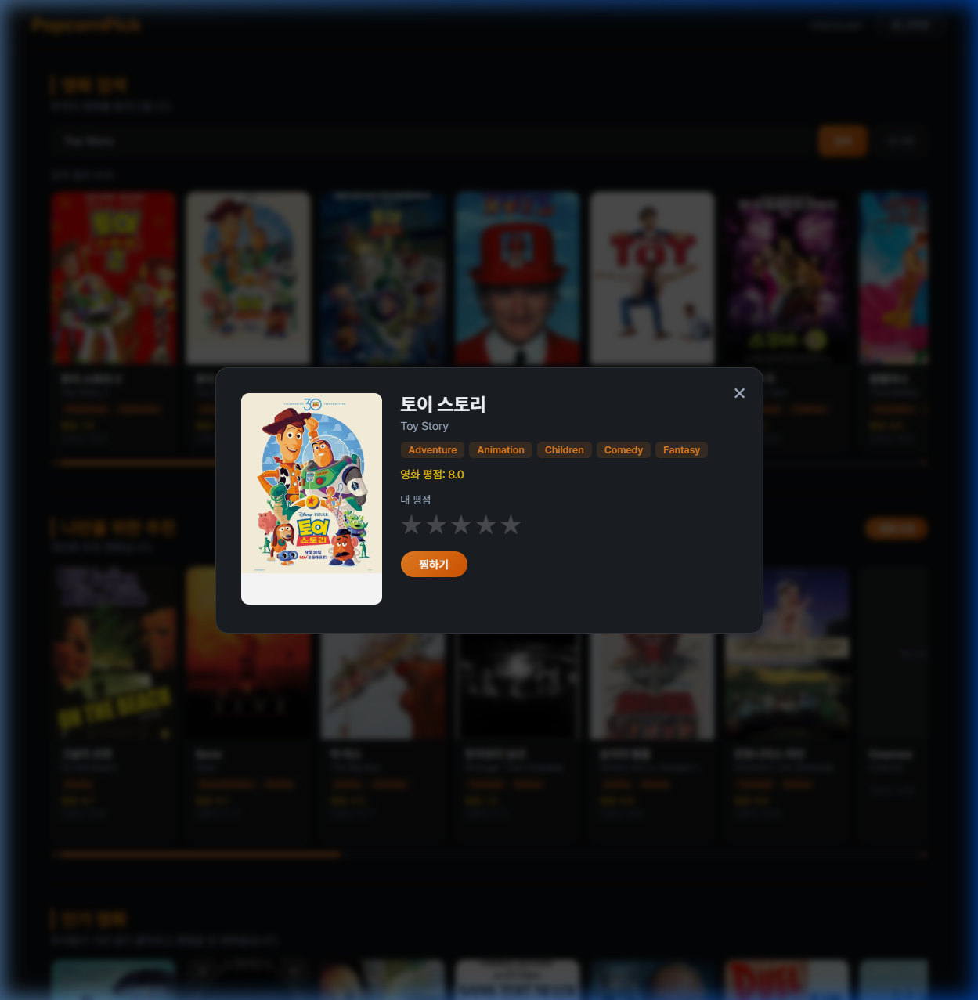

# PopcornPick - 개인화 영화 추천 플랫폼

PopcornPick은 사용자 행동 로그(클릭, 검색, 평점)를 수집하여 개인 맞춤형 영화를 추천해 주는 플랫폼입니다. 
`main` 브랜치에 병합된 전체 기능이 정상 작동하는지 여부를 검증하고 E2E 시나리오 테스트 및 발견된 연동 상의 결함을 수정한 결과 보고서입니다.

---

## 1. 최근 작업 내역 및 충돌 해결

### 1) Git 브랜치 병합 및 갈등 해결
- `dev_ljs` 브랜치에 `origin/auth` 브랜치 병합 진행 중 아래 5개 파일에서 발생한 충돌(Conflict)을 해결했습니다.
  - [main.py](main.py): 중복되는 라우터 임포트 갈등 해소 및 병합
  - [auth/api/auth_router.py](auth/api/auth_router.py): 회원가입 및 로그인 API 엔드포인트 연동
  - [auth/repository/user_repo.py](auth/repository/user_repo.py): DB 사용자 조회/등록 쿼리 연동
  - [auth/schema/user.py](auth/schema/user.py): 스키마 갈등 해결
  - [auth/service/auth_service.py](auth/service/auth_service.py): 패스워드 암호화 및 유저 검증 연동

### 2) 로그인 API 스펙 동기화 (JWT 발급 추가)
- **프론트엔드 요구사항**: 프론트엔드 로그인 페이지([LoginPage.jsx](frontend/src/pages/LoginPage.jsx))는 로그인 성공 시 백엔드로부터 `access_token`, `user_id`, `username`을 받아오도록 설계되어 있었습니다.
- **백엔드 보강**: 기존 백엔드는 단순 성공 여부(`success: bool`)만 주던 상태였기에, `.env` 내 `JWT_SECRET_KEY`를 활용해 **JWT 토큰을 생성하고 사용자 정보를 담아 응답**하도록 코드를 개선했습니다.
  - `LoginResponse`에 `access_token`, `user_id`, `username`을 선택 필드로 추가
  - `auth_service.py`에 `create_access_token` JWT 생성 헬퍼 함수를 추가하고 `authenticate_user`가 성공 시 유저 정보 객체를 반환하도록 수정
  - `auth_router.py`에서 토큰을 생성하여 로그인 응답에 내려주도록 반영

### 3) 홈 화면 유저 ID 하드코딩 문제 수정
- 메인 홈 화면([HomePage.jsx](frontend/src/pages/HomePage.jsx)) 소스 코드 중, 개인화 영화 추천 컴포넌트(`PersonalRecommendation`)와 영화 클릭 로그 전송 API(`apiClient.post('/logs')`)에 사용자 ID가 `1`로 하드코딩되어 있던 문제를 발견했습니다.
- 로그인된 유저의 실제 ID가 동적으로 바인딩되도록 `useAuthStore`를 연동하여 `user?.user_id || 1` 형태로 코드를 수정 및 보강했습니다.

---

## 2. E2E 시나리오 테스트 결과 (자동화 검증)

Docker Compose로 서비스를 띄운 후(`localhost:3000`), 웹 브라우저 자동화 도구를 실행해 가상 회원가입 및 로그인을 테스트했습니다.

### 🎥 테스트 진행 녹화본 (WebP)


### 📸 단계별 스크린샷 비교 (캐러셀)
````carousel

<!-- slide -->

<!-- slide -->

<!-- slide -->

<!-- slide -->

````

### 💡 테스트 성공 진단
- **회원가입 성공**: `checkuser@example.com` 계정이 `popcornpick_db`에 안전하게 등록되었습니다.
- **로그인 성공 & 세션 연동**: 백엔드에서 생성된 JWT 토큰 및 유저 메타데이터가 프론트엔드로 안전하게 전달되어 `localStorage`에 세션 정보가 생성되고 홈 화면 좌측 상단에 닉네임 `checkuser`가 정상 표시되었습니다.
- **기능 동작성**: 회원가입, 로그인, 검색, 상세 정보 팝업에 이르는 전체 프론트-백 연동이 에러 없이 원활하게 구동됩니다.
