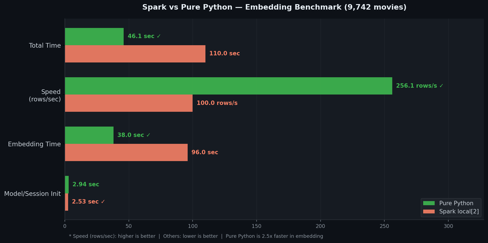
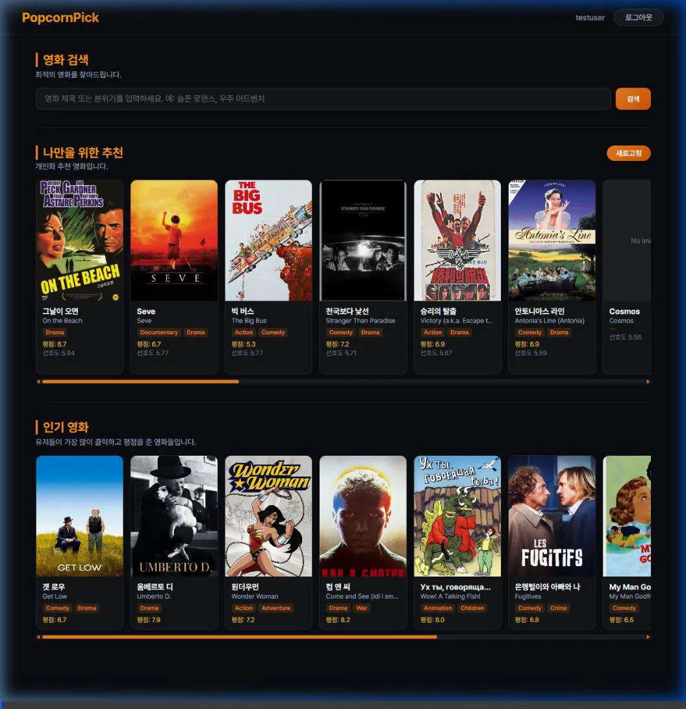

# 🍿 PopcornPick

> 실시간 데이터 파이프라인 기반 개인화 영화 추천 플랫폼

Apache Spark(분산 처리)와 FastAPI(비동기 백엔드)를 결합하여, 유저의 장기 취향(배치)과 실시간 행동 로그(스트리밍)를 동시에 반영하는 영화 추천 시스템입니다.

---

## 프로젝트 개요

| 항목 | 내용 |
|---|---|
| 팀 규모 | 4명 |
| 개발 기간 | 4주 |
| 데이터셋 | MovieLens (영화 9,742건 / 유저 610명 / 평점 100,836건) |
| 아키텍처 | Feature-based Layered Architecture |

---

## 시스템 아키텍처

```
아키텍처 이미지 넣어야함
```

---

## 왜 Spark + ALS인가?

### 현업 추천 시스템의 2-Stage 구조

넷플릭스, 유튜브 등 대형 플랫폼은 추천을 단일 모델로 처리하지 않습니다.
**후보군 생성(Candidate Generation) → 재랭킹(Re-ranking)** 2단계로 나누어 처리합니다.

```
[Stage 1] 후보군 생성 — Spark MLlib ALS (배치)
  수백만 개 아이템 중 유저가 좋아할 법한 후보 Top N 추출
  → 협업 필터링으로 잠재 요인 행렬 분해, 연산 비용이 크므로 배치로 처리

[Stage 2] 재랭킹 — 실시간 가중치 반영 (Streaming)
  Stage 1의 후보군을 유저의 최신 행동(클릭/찜/평점)으로 재정렬
  → Spark Streaming이 20초 마이크로배치로 user_genre_weights 갱신
```

PopcornPick은 이 구조를 충실히 구현합니다.

### 개인화가 트렌드인 이유

단순 인기순 추천은 모든 유저에게 동일한 결과를 제공합니다.
현대 서비스의 핵심은 **"이 유저만을 위한 콘텐츠"** 를 제공하는 것이고,
이를 위해 유저별 잠재 선호도를 학습하는 ALS가 기반 알고리즘으로 적합합니다.

### ALS(Alternating Least Squares)를 선택한 이유

| 비교 항목 | ALS | Neural CF | Content-Based |
|---|---|---|---|
| 구현 복잡도 | 낮음 | 높음 | 중간 |
| 분산 처리 지원 | Spark MLlib 내장 | 별도 구현 필요 | 어려움 |
| Cold Start 대응 | Fallback 처리 | 어려움 | 가능 |
| 협업 필터링 | ✅ | ✅ | ❌ |

> Spark MLlib에 ALS가 내장되어 있어 분산 행렬 분해를 별도 구현 없이 활용 가능.
> 4주 프로젝트에서 파이프라인 완성도에 집중하기 위한 현실적 선택.

---

## 핵심 기능 & 처리 순서 ( 예시 일뿐 )

### A. 인증 (JWT + bcrypt)

```
회원가입
  └─ 이메일 중복 확인
      └─ bcrypt로 비밀번호 해싱
          └─ users 테이블 INSERT
              └─ 201 Created 반환

로그인
  └─ 이메일로 유저 조회
      └─ bcrypt.checkpw()로 비밀번호 검증
          └─ JWT Access Token 생성 (HS256, 60분)
              └─ { access_token, user_id, username } 반환

인증이 필요한 요청
  └─ Authorization: Bearer {token} 헤더 확인
      └─ 유효하면 요청 처리 / 만료되면 401 반환
```

---

### B. 개인화 배치 추천 (Spark MLlib ALS)

```
[스케줄러] 1분 주기 실행
  └─ ratings 테이블 전체 조회 (user_id, movie_id, rating)
      └─ Spark DataFrame 생성
          └─ ALS 학습
          │   rank=10, maxIter=10, regParam=0.1
          │   유저 잠재 벡터 U(m×k) × 영화 잠재 벡터 V(n×k) 분해
          └─ 유저별 Top 20 예측 점수 추출
              └─ recommendations 테이블 DELETE → INSERT
                  └─ movies.avg_rating 집계 갱신

[Fallback] 신규 유저 (recommendations 없음)
  └─ movies.avg_rating DESC 순으로 인기 영화 반환
```

---

### C. 실시간 행동 로그 & 장르 가중치 갱신 (FastAPI + Spark Streaming)

```
[유저 행동 발생]
  └─ React에서 클릭 / 찜 / 평점 입력
      └─ POST /logs (FastAPI 비동기 엔드포인트)
          └─ action_type 검증 (CLICK | LIKE | RATING)
              ├─ RATING이면 ratings 테이블 Upsert
              └─ user_click_logs 테이블 INSERT

[Spark Streaming — 20초 마이크로배치]
  └─ streaming_offsets에서 last_log_id 조회
      └─ user_click_logs에서 신규 로그 JDBC 조회
          └─ 장르별 가중치 집계
          │   LIKE   → score 5점
          │   RATING → rating_value × 3점
          │   CLICK  → score 1점
          └─ user_genre_weights Upsert
              ON CONFLICT DO UPDATE SET weight = weight + score
                  └─ streaming_offsets 업데이트
```

---

### D. 하이브리드 영화 검색 (pgvector + Full-Text + RRF)

```
[유저 검색 쿼리 입력]
  └─ GET /search?q={query}&type=hybrid
      ├─ [Full-Text Search]
      │   plainto_tsquery로 쿼리 파싱
      │   GIN 인덱스 탐색 → ts_rank_cd 유사도 정렬
      │   상위 100건 추출
      │
      ├─ [Vector Search]
      │   all-MiniLM-L6-v2로 쿼리 임베딩 생성 (~50ms)
      │   ivfflat 인덱스로 코사인 유사도 탐색
      │   상위 100건 추출
      │
      └─ [RRF 병합]
          score(d) = Σ 1 / (k + rank(d))   k=60
          두 결과의 RRF 점수 합산 후 Top 10 반환
```

---

## 검색 시간복잡도 분석

### Full-Text Search (GIN 인덱스)

```
인덱스 없음:  O(N)         — 전체 문서 순차 스캔
GIN 인덱스:   O(log N + K) — 역색인 트리 탐색 후 K개 결과 반환

N = 9,742건 기준
  인덱스 없음: 9,742번 비교
  GIN 인덱스:  log₂(9,742) ≈ 13번 탐색 후 결과 반환
```

### Vector Search (ivfflat 인덱스)

```
인덱스 없음:  O(N)         — 전체 벡터 코사인 거리 계산
ivfflat:      O(N / lists) — 클러스터 분할 탐색

lists = 100 설정 기준
  인덱스 없음: 9,742번 거리 계산
  ivfflat:     9,742 / 100 ≈ 97번 거리 계산 (약 100배 감소)

probes 파라미터로 정확도 ↔ 속도 트레이드오프 조절 가능
  probes=1  (기본): 가장 빠름, 정확도 낮음
  probes=10:        느리지만 정확도 향상
```

### RRF (Reciprocal Rank Fusion)

```
score(d) = 1/(k + rank_FTS(d)) + 1/(k + rank_VS(d))

k=60 상수: 낮은 순위 문서의 영향력을 완화하는 역할
두 검색 결과의 순위를 역수 합산 → 정규화 없이 스케일 독립적 병합

시간복잡도: O(M log M)
  M = FTS 결과(최대 100) + VS 결과(최대 100) 합집합 크기
  → 최대 200건 정렬로 고정, 데이터 규모에 무관하게 일정
```

---

## 성능 벤치마크

### Spark vs 순수 Python 임베딩 생성 비교 (9,742건)



| 항목 | 순수 Python | Spark (local[2]) |
|---|---|---|
| 모델/세션 초기화 | 2.94초 | 2.53초 |
| 임베딩 생성 시간 | **38초** ✅ | 96초 |
| 처리 속도 | **256건/초** ✅ | ~100건/초 |
| 총 소요시간 | **46초** ✅ | ~110초 |

> **결론**: 단일 노드(local[2]) 소규모 데이터에서는 Spark pandas_udf 직렬화 오버헤드로 인해
> 순수 Python이 **2.5배 빠름**.
> Spark는 멀티 노드 클러스터 / 수백만건 이상 환경에서 진가를 발휘하며,
> 본 프로젝트에서는 **ALS 배치 추천 및 Streaming 집계**에 Spark를 집중 활용.

---

## 🛠️ 기술 스택 & 선택 근거

| 기술 | 역할 | 선택 근거 |
|---|---|---|
| **FastAPI** | 비동기 API 서버 | Python 비동기 프레임워크 중 가장 높은 처리량. 대량 클릭 로그를 병목 없이 수집하기 위해 async/await 기반 필수 |
| **Spark MLlib** | ALS 배치 추천 | 협업 필터링 행렬 분해를 분산 처리로 수행. MLlib 내장 ALS로 별도 구현 없이 유저-아이템 잠재 벡터 학습 가능 |
| **Spark Streaming** | 실시간 가중치 집계 | 20초 마이크로배치로 클릭 로그 집계. RDB 직접 집계 시 발생하는 쓰기 부하를 In-Memory 분산 처리로 분산 |
| **PostgreSQL + pgvector** | 데이터 저장 + 벡터 검색 | 단일 DB에서 정형 데이터와 벡터 검색을 동시 처리. 별도 벡터 DB(Pinecone, Weaviate) 없이 운영 가능 |
| **all-MiniLM-L6-v2** | 텍스트 임베딩 | 384차원 경량 모델. 로컬 무료 실행 가능하며 영화 제목/줄거리 임베딩에 적합. 벤치마크 결과 256건/초 처리 |
| **React + Vite** | 프론트엔드 | 컴포넌트 기반 UI. Zustand로 전역 인증 상태 관리, axios 인터셉터로 JWT 자동 주입 |
| **Docker Compose** | 컨테이너 오케스트레이션 | 4개 컨테이너(postgresql/fastapi/spark/frontend) 환경 통일. healthcheck로 서비스 간 기동 순서 보장 |
| **bcrypt + JWT** | 인증/보안 | bcrypt로 단방향 비밀번호 해싱, HS256 JWT로 Stateless 인증 구현 |

---

## DB

```
DB 이미지 넣는다
```

---

## 콜드스타트 → 개인화 전환 흐름

```
1. 신규 유저 접속
   → recommendations 없음 → avg_rating 인기순 Fallback 표시

2. 클릭 / 찜 / 평점 입력
   → FastAPI가 user_click_logs INSERT

3. 20초마다
   → Spark Streaming이 user_genre_weights Upsert

4. ALS 배치 실행 (1분 주기)
   → recommendations 갱신 (개인화 추천으로 전환)

5. 유저가 새로고침
   → 최신 recommendations 반영
```

---

## 트러블 슈팅

### 박은채 — 배치 추천 (Spark MLlib ALS)

**Cold Start 문제**
- 문제: 신규 유저는 ratings 데이터가 없어 ALS 예측이 불가능, recommendations 테이블이 비어있는 상태.
- 해결: 별도 모델 추가 없이 기존 movies.avg_rating 인기순 Fallback을 선택. 유저가 클릭/평점을 쌓으면 다음 배치 실행 시 자동으로 개인화 추천으로 전환되는 구조로 설계.

**Spark 모드 & 도커 메모리 문제**
- 문제: local / Standalone / YARN 등 실행 모드 파악에 초기 시간 소요. Docker 컨테이너 내부에서 local[2] 실행 시 driver.memory 설정만으로 OOM을 제어할 수 없었음.
- 해결: local[2] 모드로 확정 후, 컨테이너 메모리 한계와 spark.driver.memory / spark.sql.shuffle.partitions를 함께 튜닝하여 안정화.

### 팀원 B — 실시간 로그 & Streaming

> 작성 예정

### 팀원 C — 하이브리드 검색

> 작성 예정

### 팀원 D — 인프라 & Frontend

> 작성 예정

---

## 향후 발전 방향

### 1. RAG 기반 영화 추천 챗봇
현재 추천/검색 결과를 LLM 프롬프트에 주입하여 자연어로 설명해주는 챗봇 인터페이스 추가.
슬라이딩 윈도우(최근 5턴)로 대화 맥락을 유지하고, 아래 세 가지 데이터를 RAG 소스로 활용.

```
유저 질의 입력 ("액션 영화 추천해줘")
  ├─ movies.embedding     → 벡터 유사도로 관련 영화 Top 5 검색
  ├─ recommendations      → 해당 유저 개인화 추천 Top 5
  └─ user_genre_weights   → 유저 장르 선호도 상위 3개
      └─ LLM 프롬프트 주입 → 자연어 추천 응답 생성

chat_histories 테이블로 대화 이력 저장
  └─ session_id / user_id / role / content / rag_context(JSONB)
```

### 2. Locust 부하 테스트
- FastAPI 클릭 로그 수집 엔드포인트 초당 N건 처리 한계 측정
- 하이브리드 검색 응답시간 vs Full-Text 단독 비교 (목표 150ms 이하)
- ALS 배치 실행 시간 정량 측정

### 3. Redis 캐싱 레이어 추가
- 인기 영화 Top 10, 개인화 추천 결과를 Redis에 캐싱
- DB 조회 횟수 감소 → 응답시간 단축

### 4. Spark 클러스터 모드 전환
- 현재 `local[2]` → Standalone 클러스터 모드로 전환
- 멀티 노드 환경에서 ALS 학습 속도 개선 검증

---


## 팀원 역할

| 팀원 | 담당 역할 |
|---|---|
| 박은채 | Spark ALS 배치 추천, 프로젝트 리딩 |
| 팀원 B | FastAPI 로그 수집 + Spark Streaming |
| 팀원 C | 하이브리드 검색 |
| 팀원 D | Docker 환경 / DB 스키마 / 전처리 / Frontend / 인증 |

### 테스트 진행 녹화본
